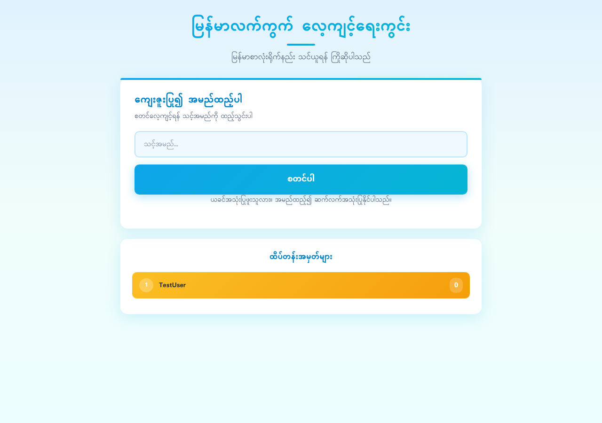

# မြန်မာလက်ကွက် လေ့ကျင့်ရေးကွင်း (Burmese Typing Tutor)

A web application for learning and practicing Burmese keyboard typing skills.




## Features

- User registration with unique name validation
- Progressive difficulty levels (5 levels from basic vowels to advanced paragraphs)
- Real-time typing speed (WPM) and accuracy tracking
- Visual keyboard with key highlighting (Shift & Caps Lock support)
- Score tracking and leaderboard
- SQLite database for persistent data storage
- Beautiful, responsive UI with Burmese font (Padauk)

## Requirements

- Python 3.8+

## Installation

1. Clone the repository:
```bash
git clone <repository-url>
cd burmese-typing-tutor
```

2. Create a virtual environment:
```bash
python -m venv venv
source venv/bin/activate  # On Windows: venv\Scripts\activate
```

3. Install dependencies:
```bash
pip install -r requirements.txt
```

4. Run the application:
```bash
python app.py
```

5. Open your browser and navigate to:
```
http://localhost:5001
```

## Usage

1. Enter your name on the welcome page
2. If the name exists, you'll get suggestions for alternative names
3. Start typing practice at Level 1
4. Complete all texts in a level to unlock the next level
5. Your scores are saved and displayed on the leaderboard

## How to Type Burmese

To type Burmese characters:
- **Mac**: System Settings → Keyboard → Input Sources → Add Burmese
- **Windows**: Settings → Time & Language → Language → Add Burmese

## Project Structure

```
burmese-typing-tutor/
├── app.py              # Flask application
├── models.py           # SQLite database models and data operations
├── typing_tutor.db     # SQLite database file
├── requirements.txt    # Python dependencies
├── README.md          # This file
├── LICENSE            # MIT License
├── .gitignore
├── static/
│   ├── css/
│   │   └── style.css  # Application styles
│   └── js/
│       ├── keyboard.js # Keyboard visualization
│       └── typing.js   # Typing practice logic
└── templates/
    ├── index.html     # Welcome page
    └── tutor.html     # Main practice interface
```

## API Endpoints

| Method | Endpoint | Description |
|--------|----------|-------------|
| GET | `/` | Welcome page |
| POST | `/api/register` | Register new user |
| POST | `/api/login` | Login existing user |
| GET | `/tutor` | Practice interface |
| GET | `/api/user` | Get current user data |
| GET | `/api/tutorials` | Get all tutorials |
| GET | `/api/tutorial/<level>` | Get specific tutorial |
| POST | `/api/submit-score` | Submit practice score |
| GET | `/api/leaderboard` | Get top users |

## Database Tables

### Users
- `id` - Primary key
- `name` (unique) - User's name
- `current_level` - Current unlocked level
- `total_score` - Cumulative score
- `completed_levels` - JSON array of completed levels
- `scores` - JSON array of score records

### Tutorials
- `id` - Primary key
- `level` (unique) - Level number
- `title` - Level title in Burmese
- `practice_texts` - JSON array of practice texts
- `description` - Level description in Burmese

## License

MIT License - see [LICENSE](LICENSE) file for details.
